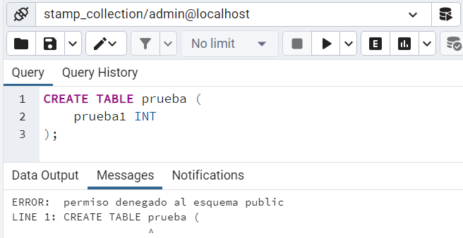
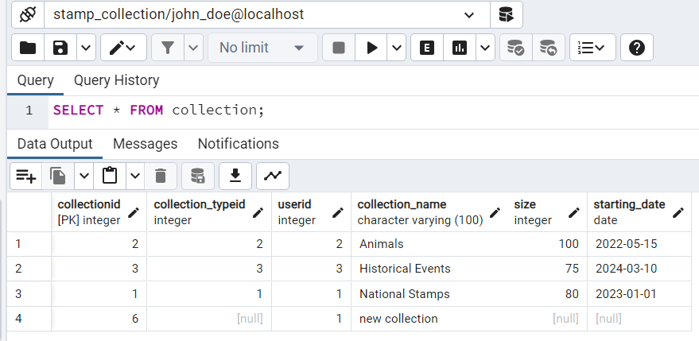
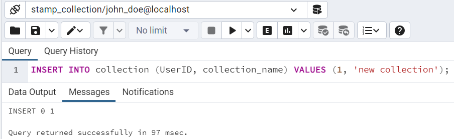
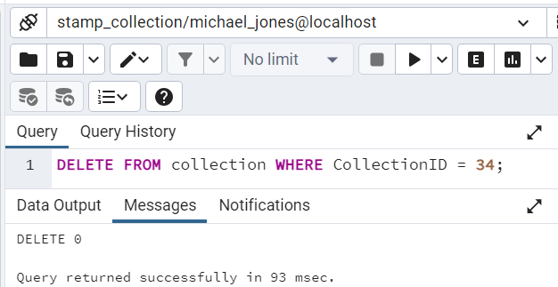
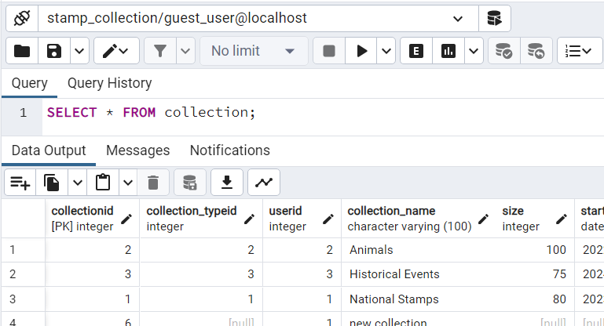
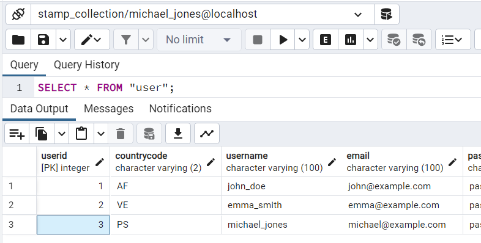
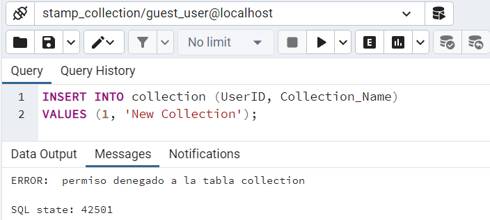
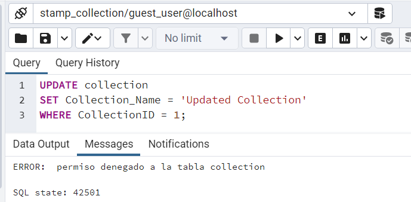
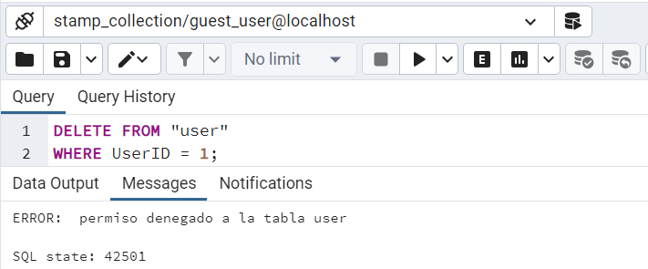

# Part 3: Security
This part is about security (RLS), roles and user creation. 
For this database, I created 3 different roles. Then I applied row level security on the tables I needed and finally I created examples of possible users.

## Explanation of roles

| Role | Explanation | Privileges |
| ----- | ------ | ----- |
| Admin | This role will be able to admin all the system, manage users and other roles. | CREATE, ALTER, DROP, INSERT, SELECT, UPDATE and DELETE in all the tables. |
| Collector | User who can access the information about stamps and collections and manage their own data. | INSERT, SELECT and UPDATE in the tables "user", "collection", "stamp" and "stamp_collection" where they are the own users, SELECT on the other tables ("country", "rate" and "collection_type"). |
| Guest | Limited access just to see the information but not being able to edit it. | SELECT on all the tables. |

I made this thinking that all the collections will be public. The guests can see the collection of all users, but not to change it.

Maybe in other model would be interesting to have the option to the users to keep their collection as private.  This would be accomplished by creating another role that could only access public information as "country" or "rate" and the collections that the users marked as visible (maybe with another column on the "collection" table which indicates if its visible or not).

I haven't done it that way because I didn't wanted to complicate it more.


## Creation of roles
``` pgsql
--creating roles
CREATE ROLE Admin;
CREATE ROLE Collector;
CREATE ROLE Guest;

-- giving full permissions to Admin
GRANT ALL PRIVILEGES
ON ALL TABLES
IN SCHEMA public
TO Admin;

-- we also could grant all of them this way
GRANT CREATE, ALTER, DROP, INSERT, SELECT, UPDATE, DELETE 
ON ALL TABLES IN SCHEMA public 
TO Admin;

-- giving permissions to Collector
GRANT INSERT, SELECT, UPDATE, DELETE 
ON "user", collection, stamp, stamp_collection 
TO Collector;

GRANT SELECT 
ON country, rate, collection_type 
TO Collector;

-- giving permissions to Guest
GRANT SELECT
ON ALL TABLES
IN SCHEMA public
TO Guest;

-- revoking permissions to Guest (just in case, because i think by default those premissions are denyed)
REVOKE INSERT, UPDATE, DELETE
ON ALL TABLES
IN SCHEMA public
FROM Guest;
```

## Row Level Security
``` pgsql
-- RLS policies to collector only being able to insert and update their own data --
-- RLS for "user" table --
CREATE POLICY user_insert_policy
ON "user"
FOR INSERT
WITH CHECK (Username = CURRENT_USER);

CREATE POLICY user_update_policy
ON "user"
FOR UPDATE
WITH CHECK (Username = CURRENT_USER);

CREATE POLICY user_delete_policy
ON "user"
FOR DELETE
USING (Username = CURRENT_USER);

-- RLS for collection table --
CREATE POLICY collection_insert_policy
ON collection
FOR INSERT
WITH CHECK (UserID =
            (SELECT UserID
            FROM "user"
            WHERE Username = CURRENT_USER));

CREATE POLICY collection_update_policy
ON collection
FOR UPDATE
WITH CHECK (UserID =
            (SELECT UserID
            FROM "user"
            WHERE Username = CURRENT_USER));

CREATE POLICY collection_delete_policy
ON collection
FOR DELETE
USING (UserID =
        (SELECT UserID
        FROM "user"
        WHERE Username = CURRENT_USER));


-- RLS for stamp_collection table --
CREATE POLICY stamp_collection_insert_policy
ON stamp_collection
FOR INSERT
WITH CHECK (CollectionID IN
            (SELECT CollectionID
            FROM collection
            WHERE UserID =
                (SELECT UserID
                FROM "user"
                WHERE Username = CURRENT_USER)));

CREATE POLICY stamp_collection_update_policy
ON stamp_collection
FOR UPDATE
WITH CHECK (CollectionID IN
            (SELECT CollectionID
            FROM collection
            WHERE UserID =
                (SELECT UserID
                FROM "user"
                WHERE Username = CURRENT_USER)));

CREATE POLICY stamp_collection_delete_policy
ON stamp_collection
FOR DELETE
USING (CollectionID IN
        (SELECT CollectionID
        FROM collection
        WHERE UserID =
            (SELECT UserID
            FROM "user"
            WHERE Username = CURRENT_USER)));

------- this policies grants access to selects to the tables -------
CREATE POLICY user_select_policy
ON "user"
FOR SELECT
USING (true);

CREATE POLICY collection_select_policy
ON collection
FOR SELECT
USING (true);

CREATE POLICY stamp_collection_select_policy
ON stamp_collection
FOR SELECT
USING (true);

-- applying the policy --
ALTER TABLE "user" FORCE ROW LEVEL SECURITY;
ALTER TABLE collection FORCE ROW LEVEL SECURITY;
ALTER TABLE stamp_collection FORCE ROW LEVEL SECURITY;


```

After doing that, I realized the Admin role should be able to skip that RLS, so we can accomplish that by giving them access to bypassrls privilege:
``` pgsql
ALTER ROLE Admin WITH BYPASSRLS;
```

## User creation examples
``` pgsql
--admin named admin_user--
CREATE USER admin_user
WITH PASSWORD 'strong_admin_pass';

GRANT Admin TO admin_user;

--collector named Username (instead of literal "Username", the name of the collector should be the same as the "Username" value on the "user" table)--
CREATE USER Username
WITH PASSWORD 'collector_password';

GRANT Collector TO Username;

--guest named guest_user--
CREATE USER guest_user
WITH PASSWORD '1234';

GRANT Guest TO guest_user;
```

## Verification
I tried some queries to ensure the security of the database.

### Admin role
#### Things that can do:

 - `SELECT * FROM collection;`

 - `INSERT INTO collection (UserID, CollectionName) VALUES (34, 'New Collection');`

 - `UPDATE collection SET CollectionName = 'Updated Collection' WHERE CollectionID = 34;`

 - `DELETE FROM collection WHERE CollectionID = 34`

#### Things that can't do:

Things outside the schema, for instance, `CREATE TABLE` or modify RLS policies.



### Collector role
#### Things that can do:
- `SELECT * FROM collection;` (can view all own collections).


- `INSERT INTO collection (UserID, CollectionName) VALUES (UserID_of_collector, 'Collector's Collection');` (can insert new collections associated with their UserID).

In order to do this, I had to execute the following:
```pgsql
GRANT USAGE, SELECT ON SEQUENCE collection_collectionid_seq TO Collector;
```

- `UPDATE collection SET CollectionName = 'Updated Collection' WHERE CollectionID = 34 AND UserID = UserID_of_collector;` (can update their own collections).

#### Things that can't do:

- Delete collections, even their own:
`DELETE FROM collection WHERE CollectionID = 34;` 



Althrough it executes, it always says "0", and when I verify if the data have been deleted, it hasn't. So it works.

- Doing any actions on tables they don't have explicit permissions for, such as:
    - Inserting data into tables they only have SELECT permissions on: `INSERT INTO country (CountryName) VALUES ('New Country');` This failed.

### Guest role
#### Things that can do:
- `SELECT * FROM collection;` Can view ALL tables.





#### Things that can't do:
- `INSERT INTO collection (UserID, Collection_Name) VALUES (1, 'New Collection');`

- `UPDATE collection SET Collection_Name = 'Updated Collection' WHERE CollectionID = 1; `

- `DELETE FROM collection WHERE CollectionID = 1;`
